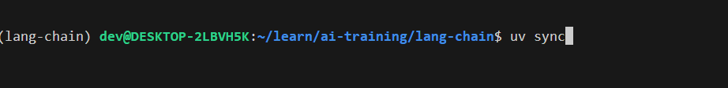

# Prerequisites for LangChain LangGraph Workshop

## 1. Dev Tech

The following technologies needs to be installed for the workshop

| Purpose | Software | Installation Link |
| --- | --- | --- |
| IDE | VSCode | [Download](https://code.visualstudio.com/download) |
| Language | Python >= 3.12 | [Releases](https://www.python.org/downloads/) |
| Python Package Manager | [uv](https://docs.astral.sh/uv/) | [Linux](https://docs.astral.sh/uv/getting-started/installation/#__tabbed_1_1), [Windows](https://docs.astral.sh/uv/getting-started/installation/#__tabbed_1_2)  |
| Local Models | [Ollama](https://ollama.com/) | [Linux](https://ollama.com/download/linux), [Windows](https://ollama.com/download/OllamaSetup.exe) |

## 2. LLMs

Predominantly we will use OpenAI or AzureOpenAI. For demonstrating locally deployed models, we will use one of `phi4`, `llama3`, `deepseek-r1` through [Ollama supported local models](https://ollama.com/search)

| Model | Execution Environment | Executor | Setup | Remarks | Required for Workshop |
| --- | --- | --- | --- | --- | --- |
| gpt-4o | Cloud | Azure OpenAI Service | Create a deployment using model `gpt-4o` in Azure | Uses your Azure credentials, expects `Cognitive Services OpenAI User` and `Cognitive Services User` Role assignments | Y |
| gpt-4o | Cloud | ChatGpt OpenAI Service | Create an API account  | Key based access | Y |
| phi4 | Local | Ollama | `ollama run phi4` | 9.1 GB mem footprint, uses GPU | optional |
| phi4-mini | Local | Ollama | `ollama run phi4-mini`  | 2.5 GB mem footprint, uses GPU | optional |
| llama3 | Local | Ollama | `ollama run llama3`  | 4.7 GB mem footprint, uses GPU | optional |
| deepseek-r1 | Local | Ollama | `ollama run deepseek-r1`  | 4.7 GB mem footprint, uses GPU | optional |

## 3. LangSmith Observability and Tracing

Create tracing project[s] in [LangSmith](https://smith.langchain.com/)

## Update .env

Update the .env file with your keys and endpoint urls

## Install Project Dependencies

In the `Terminal` run the following code to install the dependencies given in `pyproject.toml` file

## 4. Vector Database

We will be using [PineCone](https://www.pinecone.io/) as the embeddings store for RAG use case using LangChain:

- Signup and Login to [PineCone](https://www.pinecone.io/)
- When creating index collections use the following configuration

  - Embedding `text-embedding-3-small` from `open-ai` of 1536 dimensions
  - Similarity `cosine`
  - Capacity mode `Serverless` and use default selected cloud provider

### Index name

    medium-blogs-embeddings-index

## Scenarios

[Workshop Scenarios](./Workshop.md#1-simple-chain)